# Coalesce 2021 - Notes

# Monday - 6/12/2021 

## How to build a mature dbt project from scratch - Dave Matthews - dave@dbtlabs.com

### Items to investigate 
    -  Metadata API  
    - https://docs.getdbt.com/docs/dbt-cloud/dbt-cloud-api/metadata/metadata-overview 

- a number of distince stages
- maturity :
    - feature completeness : does your project use features [ tests / documentation]
- Depth
    - are you effectively using DBT's features for you ?
    - medium : testing => mature : unified /standardized testing.

###  DBT maturity 
Repo :https://github.com/dbt-labs/dbt-project-maturity     
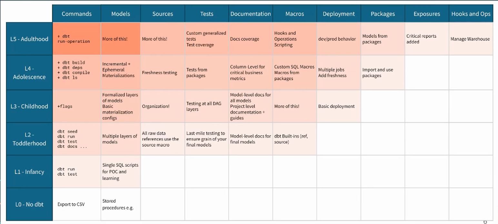

* Jinja allows us to modularize our code
* The DAG becomes more complex, but is way more modularized.

#### L3 -  Childhood 

- scaleable as goal, using standards which makes sure you have quality as you scale. High tech debt if you don't.
- meta regarding the project [linting / PR template, etc. ]
- codification of the features.
- Every single project should get here
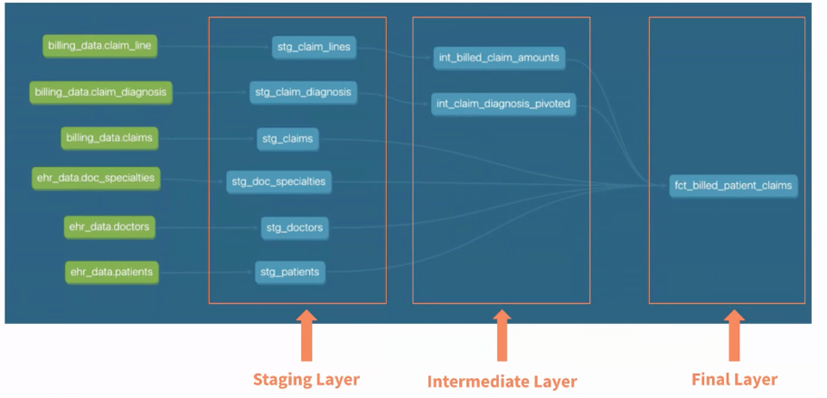

#### L4 - Adolescence 

- newest additions - packages 
- not needed, and will depend on the specific data needs
- more dimensions, flexibility, context, and speed
- expand scope, model optimizations, and source metadata. Engage with the dbt community. This will increase dbts surface areas and influence in the org. You will lose stakeholder buy in if you don't

#### L5 - Adulthood 
- answer some of the big questions 
- improve the product itself, with more metadata, relationships with other stack tools. This will incrase observality and more control. 
- Hooks and macros become more complex. Introspective queries. Project starts to self-reflect.
- test / docuementation coverage. 
- **Metadata API ?????**
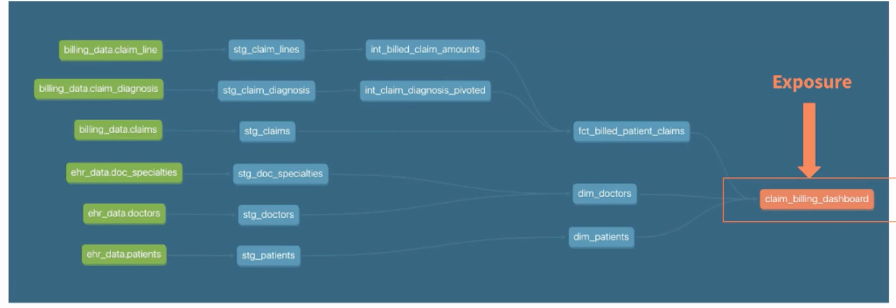

--- 

## Identity Crisis: Navigating the Modern Data Organization -  Panel

    -lots of fluff here, not really a great talk.. was expecting more 

* going from consuming data to building the platform to find the insights in the data. 
* Lots about coming into the career and being unsure about the opportunities. 
* Less about title, but moreso about the team and thier experiences, each with an area of focus. 
* lots of relationship building and cultural building when in a startup. 
* the title of analytics engineer coming in made it much easier to self-identify professionaly.

--- 
# Tuesday
---

## Tailoring dbt's incremental_strategy to Artsy's data needs - Abhiti Prabahar 

### Items to investigate 
    -  build time graph 

- Artsy : basically Etsy for art? [ scaled @ 1M visitors a week]
- Before : 
    * 16 hr build with Looker [ 100 users] 
    * 100% ownership of the pipeline
    * no testing.
- After
    * Graph migration 
    * CircleCI testing [end to end pipeline]
    * transparency with  alerting in slack 
- Transform step was taking 7 hrs [same with Extract]
    - micro-optimization of the transform step

* 50% of the build time comes from a model of `sessions`. 
* Sessions are super imprortant to this business. 
    - what is the converstation rate of email vs search ?
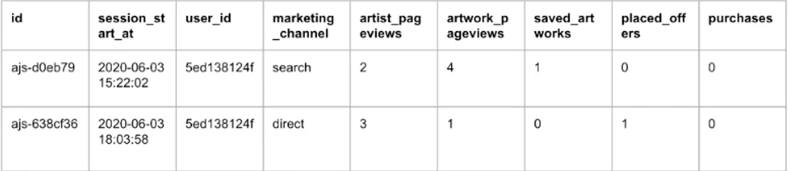
- This data can be super wide, important to keep an eye on this. 

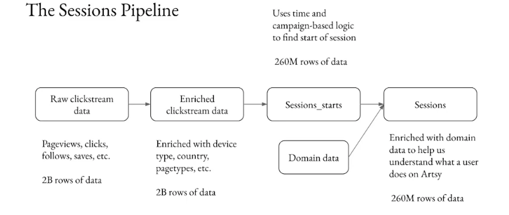

- incrementalization
    - transforming data from 1 day, rather than the entire table.
    - entire sessions pipeline has been incrementalized
- **graph for build time ? - should research** 

- activities that can change in the future. All these activities needed to take place 180 days  in the past.

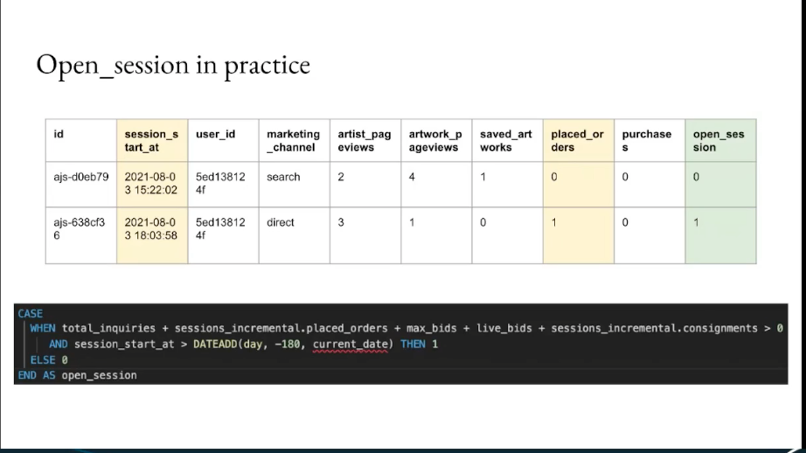

    - instead of rebilding the world, only rebuild those rows with the session_open
    - Instead of 17hrs => 5.5Hrs
        - Immutable : rebuild for the past day 
        - Mutablle : rebuild all rows that are open session or all data in the past 1 day .

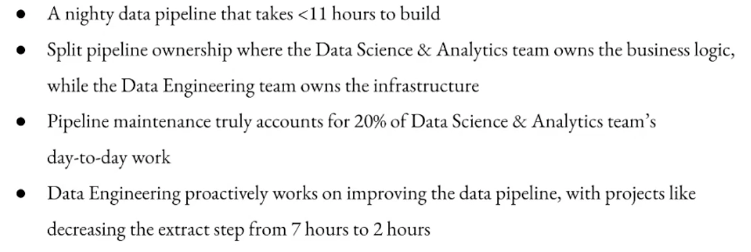

--- 

## Smaller Black Boxes: Towards Modular Data Products - Stephen Bailey 

- value of the data stack was not obvious to everyone
- Data product thesis :
    - data professionals create data products. These products are the ones that deliver business value. 
- break down the monlith of data into smaller parts 

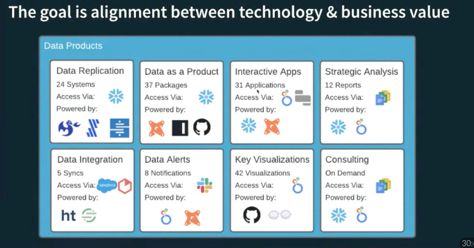

- disconnect between the user story and the actual work being done 
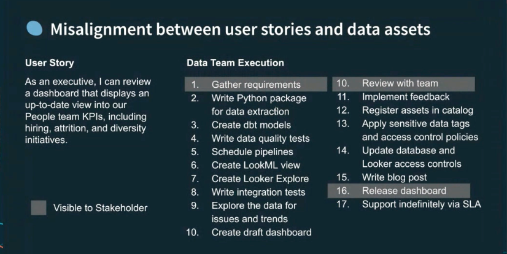
- you can create an "invoice" for the ask and present that

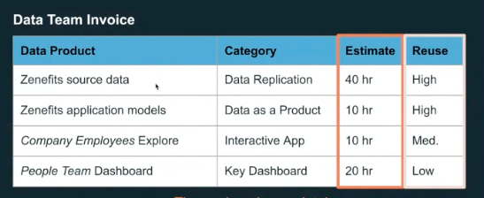

- each part is it's own data product, and only the last part of each data product can be used by developers, everything else should only be seen / interacted with by data. 

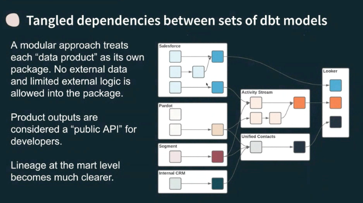

---

## Operationalizing Column-Name Contracts with dbtplyr - Emily Riederer 

    more detail : https://emilyriederer.netlify.app/post/convo-dbt/

- each step in the pipeline relies on human input [ with some amount of expectations for them . ]
- column names are contracts [ persists throughout the stack]
    - Interfaces ,configs, code = > dev:user, dev:dev,dev:machine 

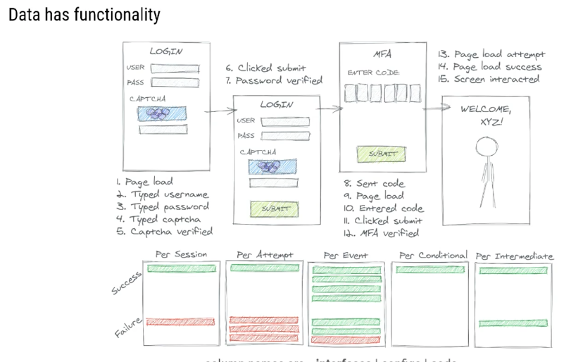

- interfaces : universal symbols [ save button] / grouping [ arrow keys] / aesthetics [ submit in green / cancel in red ]

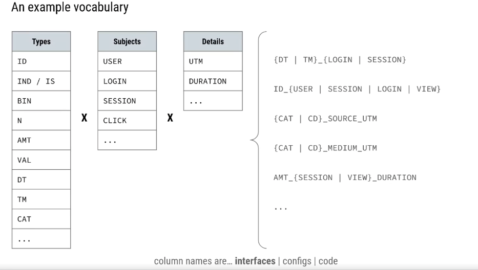

- changing the names on the variables might help to better understand the data [`LOGIN` vs `BIN_LOGIN` where `BIN` : `BINARY- NULL `]

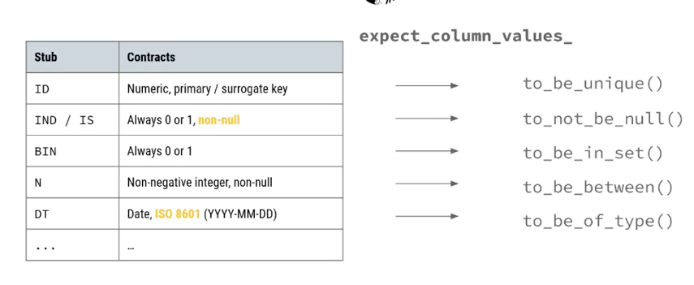

- standardization allows for a shared understanding between data analysts and engineers
- `change once, update everywhere`

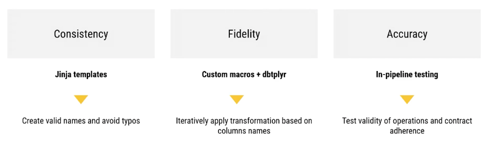

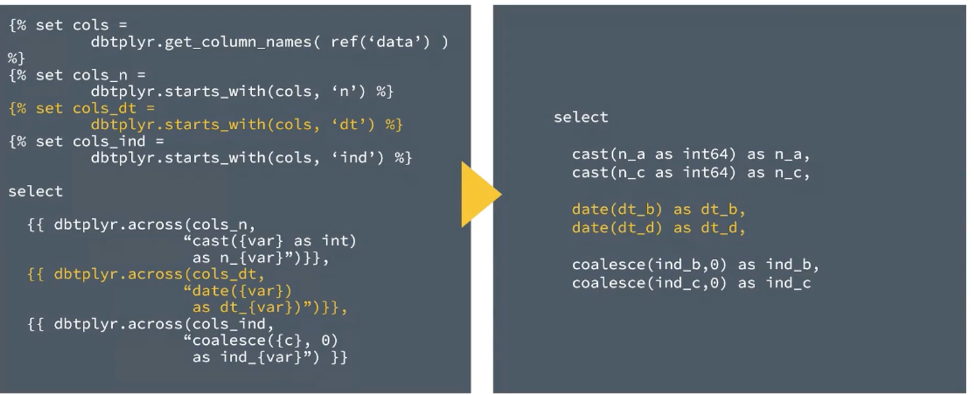

very neat concept. Operationalizing it will be difficult and time consuming. It has some nice items in it, but I am not sure about the time investment that would be needed. 

--- 

## Batch to Streaming in One Easy Step - Emily Hawkins & Arjun Narayan

    - https://materialize.com/introducing-dbt-materialize/
    - marketing pitch.  Quite good, but very challenging to implement, and needs a culture surrounding the streaming architecture.. Additionally, not very mature ( seems like a startup). Forces the upkeep of 2 DWH and 2 DBT projects. seems like a bit of pipedream 

- batch : reads data, calculates, then spits out results
- streaming : new data comes in and gets new results. 
- realtime data > not realtime data 

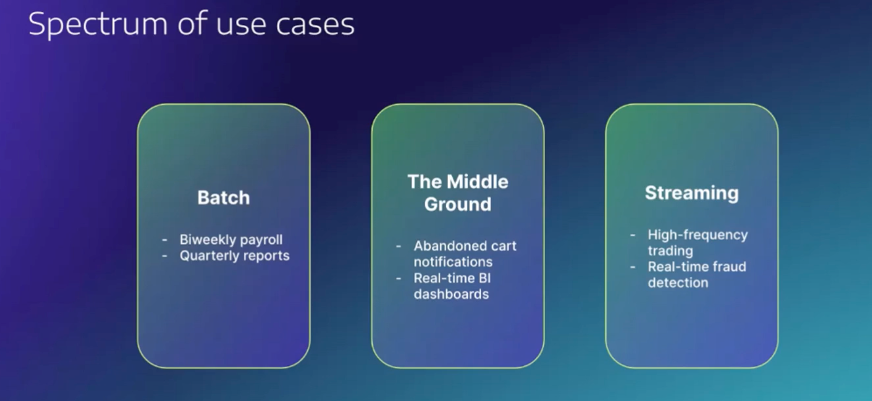

- streaming does not support SQL and that is why it is not used as much.

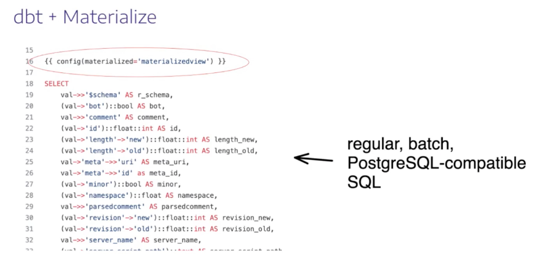

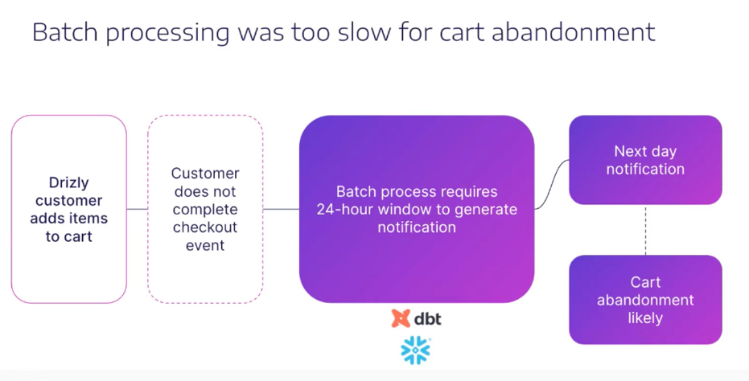

- down to 30 mins instead of 24 hours on cart abandonment 

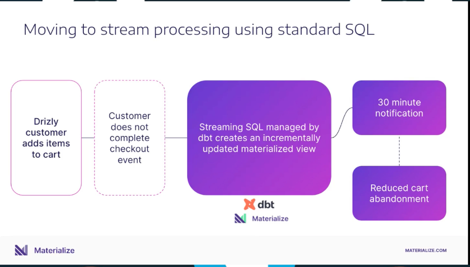

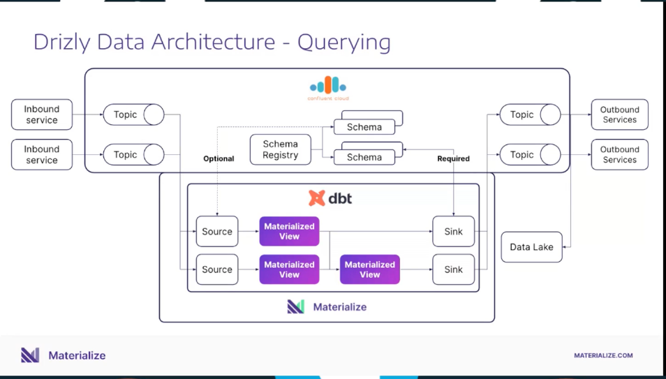

---

## Observability Within dbt -  Kevin Chan & Jonathan Talmi

    - basically, use dbt cloud. if you can't, use `dbt artifacts` and make your own observability. We use dbt cloud, all good . 
    - https://docs.getdbt.com/docs/dbt-cloud/dbt-cloud-api/metadata/metadata-overview 

- observatlity is key to minimizing data downtime 
- when you can't answer questions about your models, you are probably not observing enough
- Data sources
    - manifest 
    - run results [artifacts] - detailed node and pipeline execution data 
    - query history
- combining dbt artifacts and query history led to more data insights
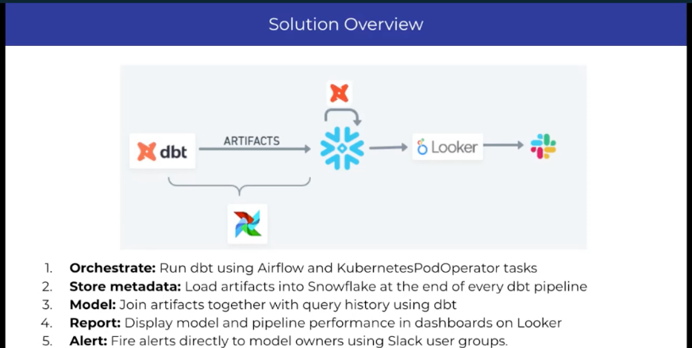

- model metrics like this are quite neat
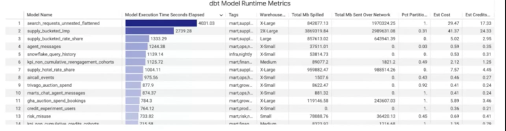
---
# Wednesday - 8/12/2021 

## The Endpoints are the Beginning: Using the dbt Cloud API to build a culture of data awareness - Kevin Hu - Metaplane

    - DBT will be putting more effort into the API 
    - Sample code to use this 
        - https://github.com/metaplane/dbt-coalesce-2021-codebase 

- EDT : Executive - driven testing 
    - poor decision making by stakeholders
    - 3 subquestions [ what is wrong / what is impact/how can I fix it ?]
        - typically, we can't make our own informed decisions.
- cloud API  [ monitoring + administration]
- metadata [ graphQL API for the metadata( sources, nodes, seeds, etc.)]

- very interesting talk. might be worth looking at the github above. Very neat, implementing would be very challenging and time consuming.

---

## DBT 1.0.0 Reveal 

    - https://docs.getdbt.com/blog/upgrade-dbt-without-fear
    - https://getdbt.slack.com/archives/C37J8BQEL/p1638815604398700

- Not much else here, lots of classical literature references
- Docs need to be examined to see what can break and what we need to do for upgrading

--- 

## Firebolt Deep Dive - Next generation performance with dbt - Firebolt 

- sub second analytics at Terabyte scale [indexes/ advanced queries]
- why current DWH are slow 
    - 1-2% of the data is scanned, but DWH need to be scan everything
    - sparse data index : point to  small data ranges within files, which can be scanned 
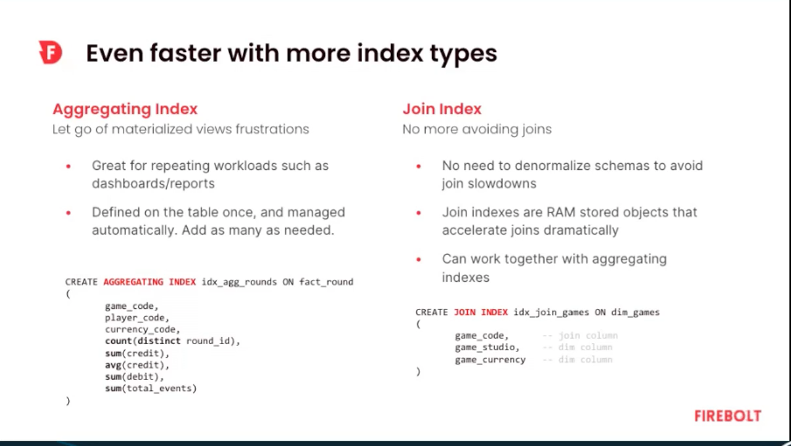
- tech demo was neat. would have liked to see some comparison to other DWH

## dbt for Financial Services: How to boost returns on your SQL pipelines using dbt, Databricks, and Delta Lake  - Ricardo Portilla (Lead Solutions Architect, Databricks)

- Data silos / lakehouse 

    - https://github.com/rportilla-databricks/dbt-asset-mgmt 

- hadoop / spreadsheets won't let us go into the future. 

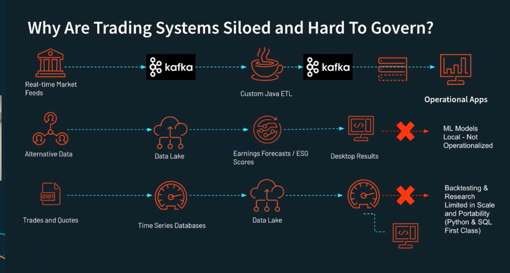
- different process/ codebase for each of the pipelines.
- Lakehouse : combination of DWH and Datalake 
    - optimized for data lake
    - open design, so any tool can access the underlying data.
    - cloud storage enables transformation in the data lake or the data warehouse.

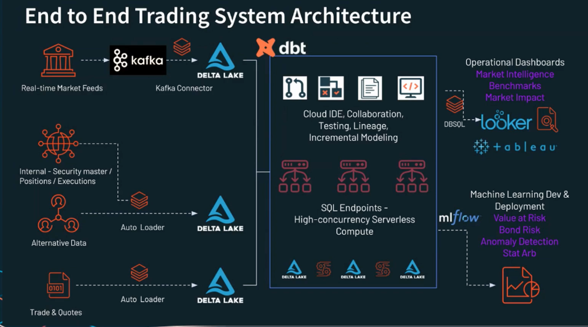

- interesting, but only if you need real time streaming data. 
- keeping structured and unstructured data in the same place is really nice . 

---

# Thursday - 10/12/2021 
 
## Introducing the activity schema: data modeling with a single table - Ahmed Elsamadisi

    - so.. this was just a marketting pitch for thier startup. They introduced a neat thing, said it was super hard to do , and that only thier company can do it in a nice way.. 
    - https://github.com/ActivitySchema/ActivitySchema 

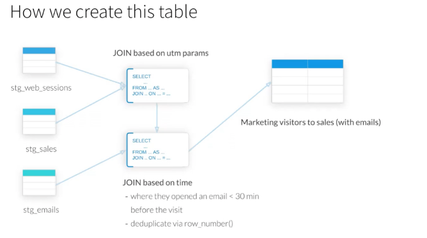

- idea: same structure . all joins would be joined based on customer and time
- single layer of dependency 
- this is called the activity schema and relationships.

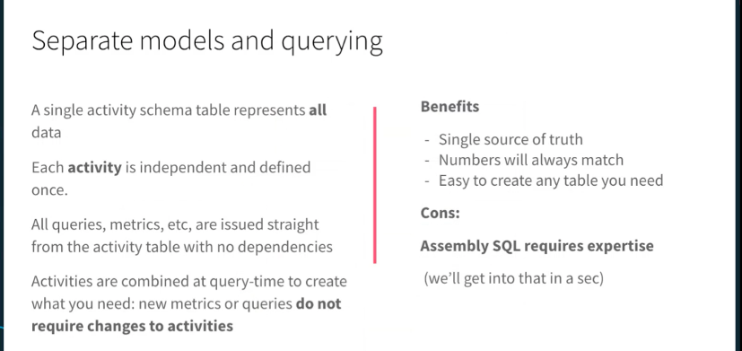

- single source of truth, things are faster
- this idea is to make a single source of truth from the source tables. 

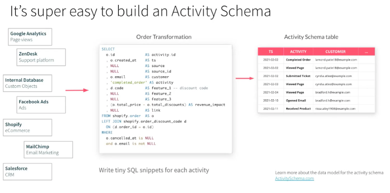

- identity resolution 
- SQL is incredibly complicated. 

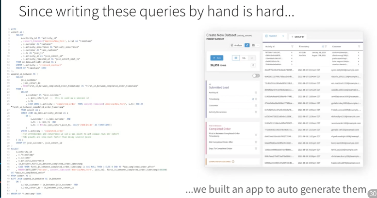

- what you can do with this is to standardize the data for common uses. 

- Interesting idea, I think we are already kind of using this approach with our one-stop-shops, but this looks way more complicated and can be more confusing. Additonally, seems like it uses alot of strings, but that might have been for visualization purposes. Might be worth checking out the github for the spec. 

## Upskilling from an Insights Analyst to an Analytics Engineer 

- work with members of the team and ask them for thier ambitions
- what skills do you need to get there / what support can you get ?

- communication 
    - Biz words => data [what tables /fields does this represent?]
    - storytelling => understanding how to tell the story to the stakeholder
    - project management => "when can we get this by"
- SQL 
    - select / filtering /efficiencies
    - consistent style 
    - **lines of codes are cheap / brain power is expensive**

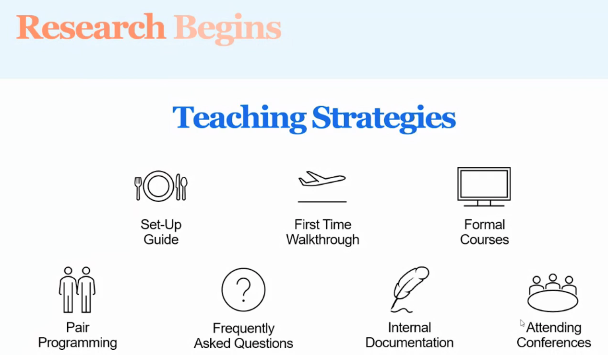
- paired programming 
- if you get a question, should be able to point to documentation.
- implement lots of creative problem solving [ use macros for example]

- Data governance 
    - consistent sources 
    - terminology 
    - business logic 

## Modeling event data at scale (Premier Sponsor) - Will Warner - Paul Boocock

    - one of the best talsk for sure, really interesting and offered some interesting thoughts about incremental modeling and a potentially new approach.

- behavioural event data : data that captures each action a user /service performance at a given time, with the corresponding state.
- thinking about scaling growth data from 20k to 50m in a few years.

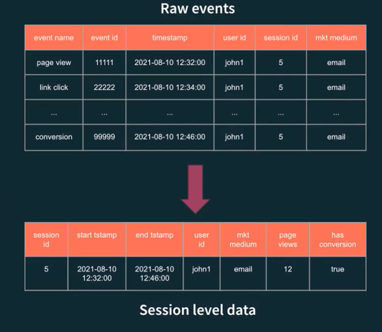

- adding funnel anlalytics / content analytics[ scroll depth - are people actually reading everything?] / cart abandoment
- as there is growth :
    - reduced performance [ query execution time increases / queue times increases / failure rate increases]
    - warehouse costs increase.

- consolidate will allow the savings of cost and time.
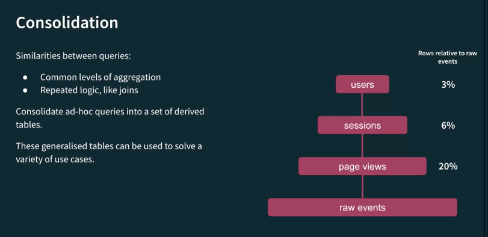

- ideas : drop and re-compute / incremental table creation. 

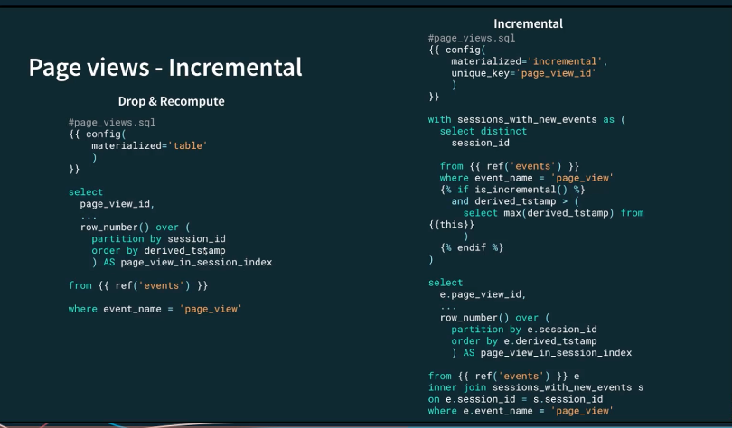

- switching from derived_timestamp => collector_timestamp means you are less likely to lose out on data. 

How to process the least amount of data :
- ensure filter on the partition/ sort keys of the source
- restrict table scans 

- we are limiting the refreshes to be only on those sessions that had pageviews, and only within the last 3 days.

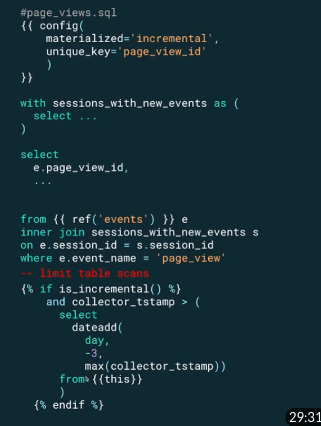

- performance tuning 
    - avoid SQL antipatterns [ self joins bad]
    - choice of partition/ sort keys
    - awareness of relative cost of functions. 

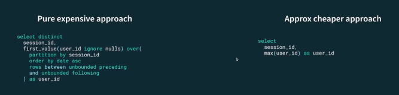

#### Old Approach
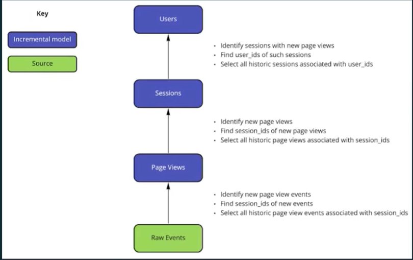

#### New approach 
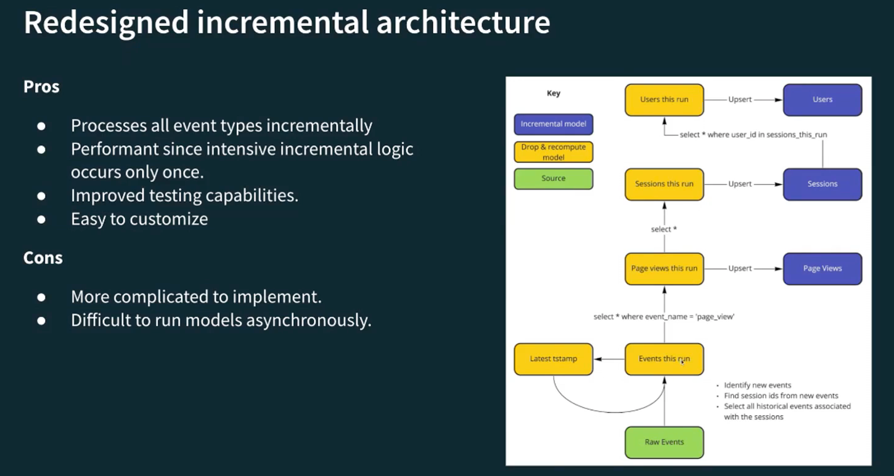

--- 
## Stay Calm and Query on: Root Cause Analysis for Your Data -  Francisco Alberini 

- Data downtime : time when your data is wrong or incomplete. 
- Defining severity levels : how urgently something should be fixed. 
    - testing frameworks/ CI/CD 
- the sprawl of the data becomes very difficult to contain. 
- someone is responsible for data integrity, but there is no defined control structures.

- break down the root cause 
- data 
    - what about this field makes it unique ?
    - an anomaly could take place due to the actions taken 
        - ex : marketting campain adding many rows into a source table
    - understanding the lineage of your tables.-++
- code
- operational environment 
    - ripple effect issues 
    - query execution timings
    - documentation of the incidences and the steps. 
    - SLA /SLO/ SLI     
    - 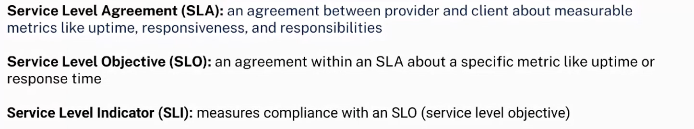
    - time to detection is a key piece

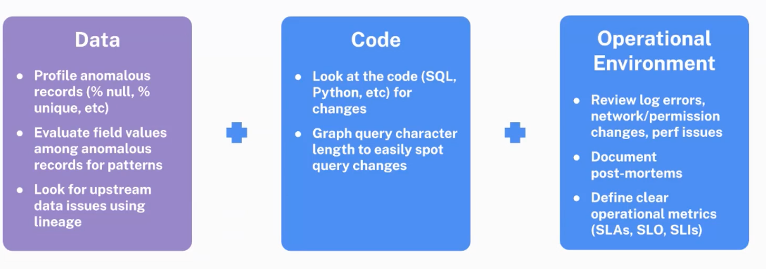

--- 

## Getting Meta about Metadata: Building Trustworthy Data Products -  Angie Brown & Kelechi Erondu

    - beginner - focused talk about testing and how you could create a dashboard about the metadata

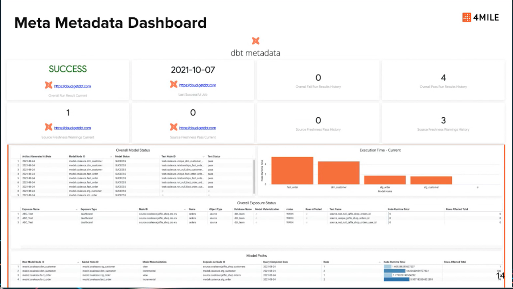

talk was mainly about the different types of tests
- schema / generics/ singular / etc.

---
## Eat the data you have: Tracking core events in a cookieless world - Jeff Sloan

- sythetics event 
    - look like front end events, yet are not front end events
    - order_id / order_date => event_id/ event_date/event_name

- event tracking is incomplete 
    - cookie analogy : " how many cookies did you make ?"
        - do you measure by cookie dough made or by number of cookies in baking sheet?
    
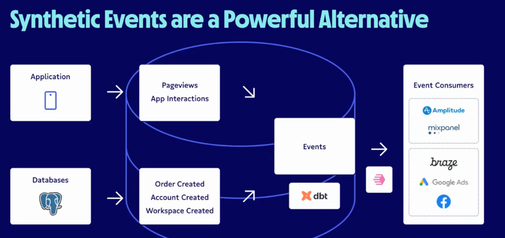

### WHY 

- accuracy
    - sythetic events rely on validated datasets
- cross- domain product analysis 
    - non product business events
        - product interactions lead to support tickets?
        - are more recently acquired cohorts submitting less tix?
        - do trials with midway check in call convert more highly ?

- autonomy 
    - data team is able to do more by itself, no need to incorporate many teams.

---